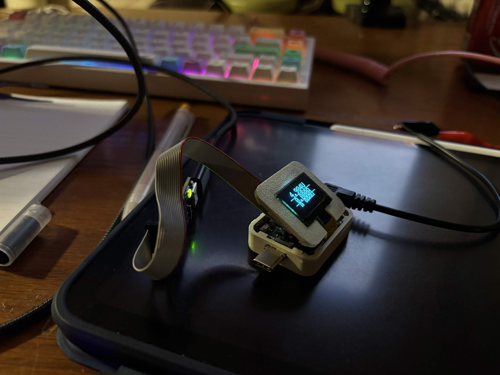
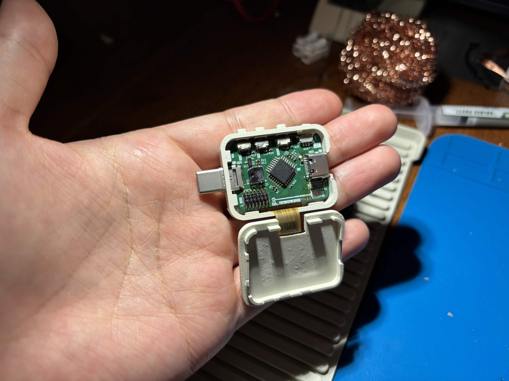
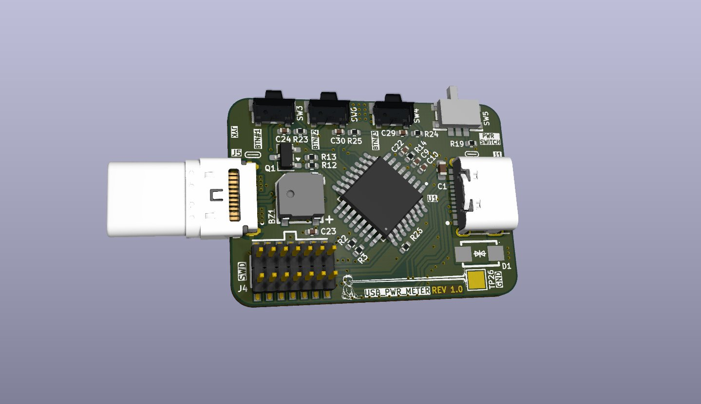
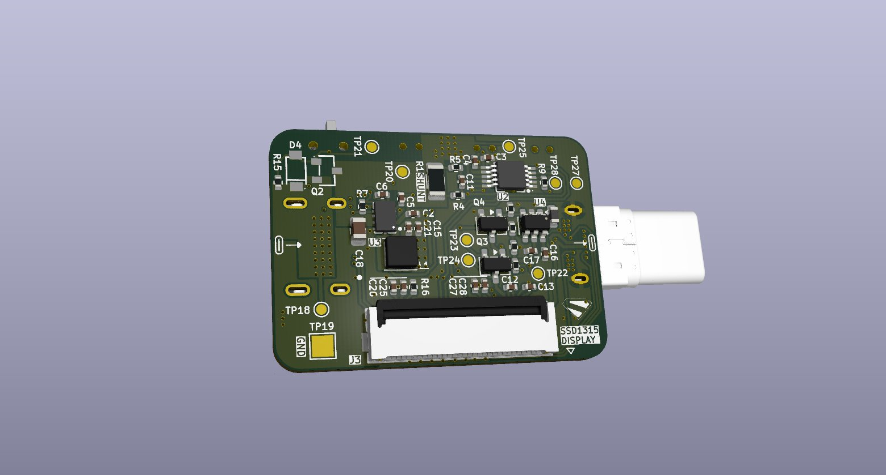
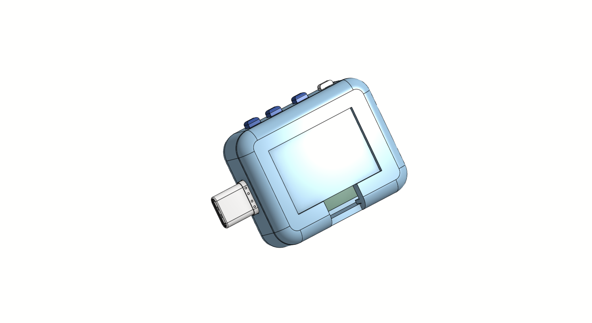
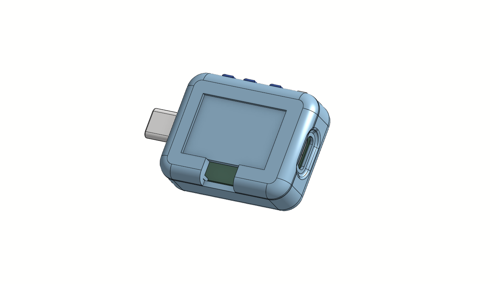
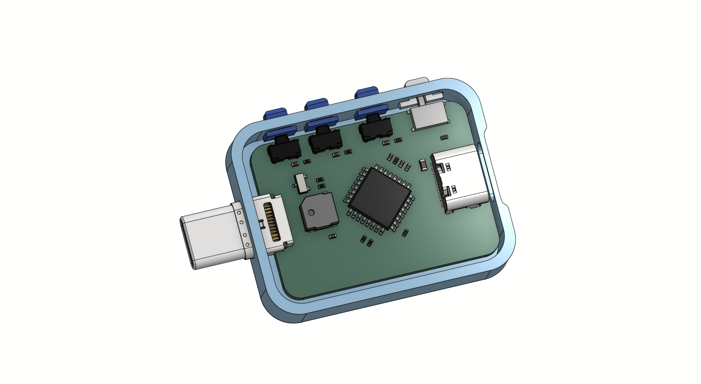
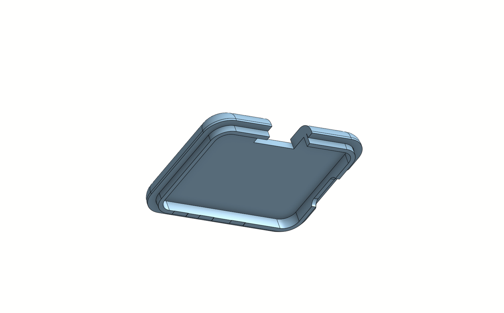

# USB-C Power Meter

<p align="center">
  
  
</p>

A compact USB-C passthrough power meter that displays real-time voltage, current, and power on an integrated 128×64 OLED screen. It sits inline between a USB-C charger and a device — all USB signals pass through transparently while the onboard MCU samples the INA238 power monitor and drives the display.

---

## Features

- **Real-time readout** — voltage, current, and power updated continuously
- **Rolling graphs** — 128-sample circular-buffer plots for current and power with live, average, and peak annotations
- **Running averages** — displayed in the footer of the main meter screen
- **Boot animation** and **dancing-banana easter egg**
- **Buzzer** with user-configurable tones and mute toggle
- **Power switch** and **navigation buttons** for menu control
- Full USB-C signal passthrough (VBUS + data lines)

---

## Specifications

| Parameter | Value |
|-----------|-------|
| Input voltage range | 0.3 V – 48 V |
| Max continuous current | 5 A |
| ADC resolution | 16-bit (INA238) |
| Display | 128×64 OLED (SSD1315), I²C |
| MCU | STM32G030K6T6 (LQFP-32) |
| MCU/peripheral supply | 3.3 V buck from VBUS |
| OLED supply | 3.8 V boost |
| Passthrough | USB-C male + USB-C female |

---

## PCB

<p align="center">
  
  
</p>

Designed in **KiCad 10**. All custom symbols and footprints are in `libs/`.

### Key ICs

| IC | Function |
|----|----------|
| INA238 | 16-bit high-precision power/current/voltage monitor (shunt + bus voltage) |
| STM32G030K6T6 | Measurement processing, graph engine, display control |
| SSD1315 | 128×64 OLED controller (I²C) |
| LMR36006 | VBUS-to-3.3 V synchronous buck regulator |
| DGS0010A | 3.8 V boost supply for OLED |

---

## Enclosure

<p align="center">
  
  
  
</p>
<p align="center">
  
</p>

3D-printable enclosure designed in OnShape:
[View in OnShape](https://cad.onshape.com/documents/12768789c7e8d715e02a9c44/w/91224a42db391f032592c489/e/40e560f0614cc0d05faddfcd?renderMode=0&uiState=6a30851d7d6de7ff176b633c)

---

## Development Videos

| Video | Description |
|-------|-------------|
| [PCB Assembly](videos/pcb-assembly.mp4) | Soldering and assembling the board |
| [Display Testing](videos/display-testing.mp4) | OLED display bring-up and meter UI |
| [Buzzer Testing](videos/buzzer-testing.mp4) | Buzzer tone testing |

---

## Firmware

Written in C using STM32CubeIDE with the STM32 HAL. Targets the STM32G030K6T6.

### Display Modes

| Mode | Description |
|------|-------------|
| **Main Meter** | Two-column header (VOLT / AMPS), large 2× readout, full-width power row, footer with running averages |
| **Current Graph** | 128-sample rolling plot of current (mA), dashed line = running average, header shows live + avg + peak |
| **Power Graph** | Same layout as current graph but for power (mW) |

Navigate between modes with the onboard buttons.

### Source Modules

| File | Purpose |
|------|---------|
| `main.c` | HAL init, main loop, buzzer tone engine |
| `meter.c` | Display screens, graph circular buffer, button debounce |
| `oled.c` | SSD1315 OLED driver (I²C, page-mode framebuffer) |
| `ina238.c` | INA238 driver — shunt/bus voltage, current, power registers |
| `boot.c` | Animated boot screen |
| `banana.c / banana_frames.c` | Dancing-banana easter egg animation |
| `generate_frames.py` | Converts 249×246 GIF PROGMEM bitmaps to SSD1315 page-format C arrays |

### Building & Flashing

1. Open `Firmware/ST/` in **STM32CubeIDE**
2. Build (Ctrl+B) — targets STM32G030K6T6, `STM32G030K6TX_FLASH.ld`
3. Flash via the SWD header on the board using ST-Link or a compatible programmer

---

## Repository Structure

```
USBpowermeter.kicad_pro       KiCad project
USBpowermeter.kicad_sch       Schematic
USBpowermeter.kicad_pcb       PCB layout
libs/
  Library.kicad_sym           Custom schematic symbols
  Library.pretty/             Custom footprints
  3dmodels/                   STEP models for 3D viewer
Firmware/ST/
  Core/Src/                   Application source (C)
  Core/Inc/                   Application headers
  Drivers/                    STM32 HAL + CMSIS
  generate_frames.py          Bitmap conversion tool
images/                       PCB renders, enclosure CAD, real photos
videos/                       Development and testing footage
```
